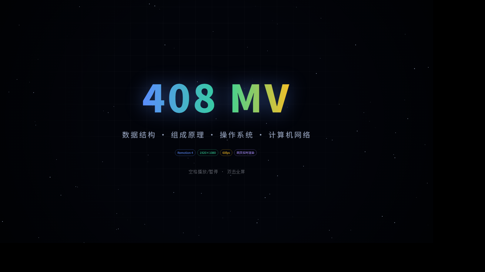
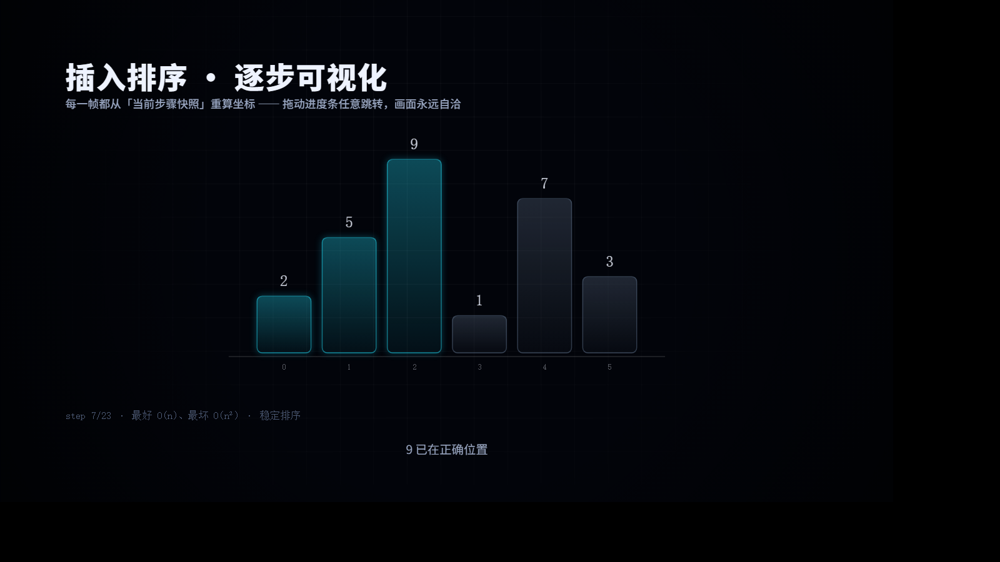
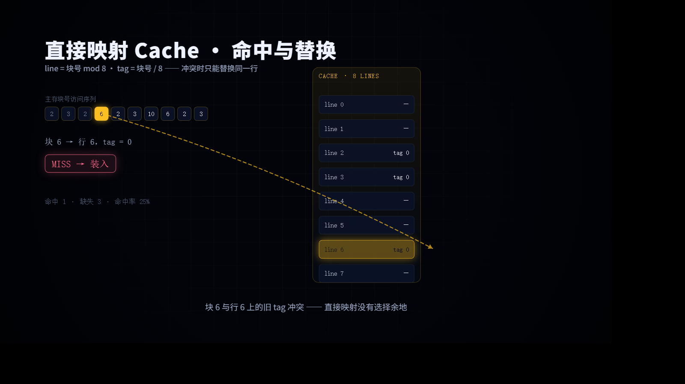
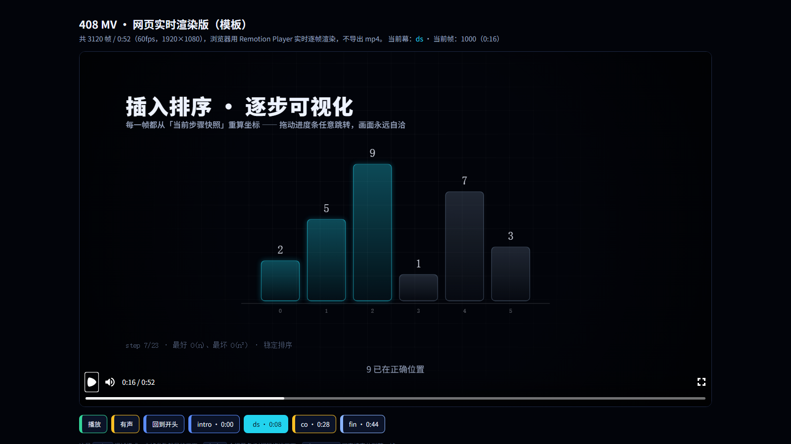
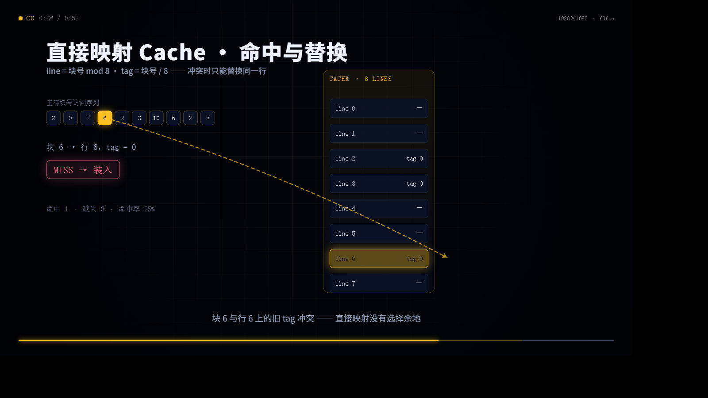

# Remotion 工程 → 网页实时版 最小可跑模板

一套 Remotion（React）动画工程，**同一份代码同时产出两种东西**：

| 输出 | 命令 | 说明 |
|---|---|---|
| 渲染成片 mp4 | `npm run render` | `remotion render MV408 out/mv.mp4`，h264 / crf 17 / yuv420p |
| 网页实时版 | `npm run web:dev` / `npm run web:build` | `@remotion/player` 在浏览器里逐帧实时渲染，不导出视频 |

思路参考 [408.bemly.moe](https://408.bemly.moe/)（[Bemly/408](https://github.com/Bemly/408)）：那里的「网页实时版」正是把 Remotion 工程用 Player 跑起来，而不是播一个 mp4 文件。

## 效果预览

网页版默认就是**一块视频**：整屏黑底 + 16:9 画面，没有页面说明、没有章节按钮、画面里也没有进度条。

| 开场 | 数据结构 · 插入排序 | 组成原理 · 直接映射 Cache |
|---|---|---|
|  |  |  |

需要调试时才用参数把界面调出来：

| `?ui=1` 调试界面 | `?hud=1` 把 HUD 烧进画面 |
|---|---|
|  |  |

截图都是这套模板真跑出来的（headless Chrome 打开 `web:dev`，`?frame=` 定位到指定帧）。

## 快速开始

```bash
npm install

npm run studio       # Remotion Studio 预览（改代码即时看效果）
npm run web:dev      # 网页实时版：Vite 开发服务器
npm run render       # 渲染成片 out/mv.mp4（首次会下载 Chrome Headless Shell）
npm run still        # 只渲染一帧 out/still.png
```

其它：

```bash
npm run typecheck       # tsc --noEmit
npm run check:sort      # 排序演示的快照序列自检（每步必须是合法排列）
npm run timeline        # 把 src/timeline.ts 导出成 audio/timeline.json
npm run audio           # 用 numpy 程序化生成配乐 public/music.wav
npm run audio:mp3       # 转出网页流播版 web-public/music.mp3（需要 ffmpeg）
npm run web:build       # 构建网页版到 dist/
```

## 目录结构

```
src/                     Remotion 主工程（渲染 + 网页共用）
  index.ts               registerRoot
  Root.tsx               <Composition id="MV408" …>（Studio / 渲染入口）
  Main.tsx               主合成：背景 + 所有镜头 + HUD + 音频
  timeline.ts            ★ 唯一真相：ACT_DEFS / SHOTS / TOTAL / ACT_RANGES
  theme.ts               配色、字体栈、缓动与 prog() 工具
  fonts.ts               渲染端字体加载（delayRender，保证成片字型不闪）
  components/
    Shot.tsx             ★ 转场系统 + <Shots> + useF()/useShot()
    Background.tsx       随幕色渐变的背景
    ui.tsx               Txt / Arrow / Caption / ActHUD
    kit.tsx              Card / Chip / Cell / popIn / stepAt
  scenes/                各个镜头（每个都是一个纯组件）
web/                     网页实时版外壳（Player + 章节跳转 UI）
web-public/              网页上线用静态资源（music.mp3 / fonts / CNAME / .nojekyll）
public/                  渲染用静态资源（母带 music.wav / 全量字体）
audio/make_music.py      程序化配乐脚本（numpy + 标准库 wave）
scripts/                 时间轴导出、排序自检等辅助脚本
dist/                    web:build 产物（推到 gh-pages 的就是它）
```

## 三个核心概念

**1. 动画是「帧号 → 画面」的纯函数。**
每个场景都用 `useF()` 拿到「场景内帧号」，所有位置/透明度/颜色都由它算出来。所以：

- 网页里拖动进度条、点章节按钮 seek 到任意帧，画面永远自洽（不需要「播过去」）；
- 渲染成片时逐帧截图，结果和网页里看到的完全一致；
- 调试某个镜头只要 `?frame=1000` 直接跳过去。

**2. 时间轴是唯一真相（`src/timeline.ts`）。**
`ACT_DEFS` 按幕列出镜头（组件 + 时长 + 入场转场），下面自动摊平成带 `start/end` 的 `SHOTS`，`TOTAL` 是总帧数。网页播放器的 `durationInFrames`、HUD 的进度条、音频的小节数、章节跳转按钮全部从这一处派生 —— 改镜头不用改别的地方。

**3. 转场是相邻镜头共享的（`components/Shot.tsx`）。**
每个镜头只声明自己的入场转场（`ZOOM / SLIDE / RISE / IRIS / FLASH`），出场时复用下一个镜头的入场转场，于是相邻镜头天然重叠若干帧，形成连续运镜而不是硬切。转场本身就是 CSS 的 `scale / translate / clip-path / mask / blur` 按帧插值。

## 网页实时版怎么接（`web/App.tsx`）

```tsx
<Player
  component={Main}                                        // 直接复用渲染用的主合成
  inputProps={{musicSrc: `${BASE}music.mp3`, mute, hud}}  // 网页传压缩版音频；hud 默认关
  durationInFrames={TOTAL} fps={60}
  compositionWidth={1920} compositionHeight={1080}
  controls={UI}                                          // 只有 ?ui=1 才出进度条等控件
  loop clickToPlay acknowledgeRemotionLicense
  style={UI ? {width: '100%'} : {width: 'min(100vw, 177.78vh)'}}   // 默认整屏 16:9
/>
```

| URL 参数 | 效果 |
|---|---|
| 无参数 | **纯画面**：整屏 16:9，点一下播放、空格暂停/继续、双击全屏；没有进度条、没有章节按钮 |
| `?ui=1` | 调试 UI：标题说明、章节跳转按钮、播放/静音、当前帧读数、播放器进度条 |
| `?hud=1` | 把幕名 / 时间码 / 进度条烧进画面（渲染成片想要同样效果就给 `<Composition defaultProps={{hud: true}}>`） |
| `?frame=2200` | 深链：直接定位到第 N 帧 |

- **章节跳转**：`playerRef.seekTo(ACT_RANGES[i].s)`，`?ui=1` 下那排按钮就是 `ACT_RANGES` 渲染出来的；
- **状态回读**：播放器用事件往外推状态（`play` / `pause` / `frameupdate`），页面按钮随之联动；
  ⚠️ 注意 `onFrameUpdate` 这类 prop 在新版 `@remotion/player` 里已经没有了，用 `addEventListener('frameupdate', …)`；
- **深链**：`?frame=2200` 直接定位到某一帧，方便分享和调镜头；
- **字体**：`FontFace` 异步加载，不阻塞首屏（没下完先用系统字体顶）；渲染端则用 `delayRender/continueRender` 等字体就绪。

## 两套静态资源：`public/` vs `web-public/`

| 目录 | 给谁用 | 放什么 |
|---|---|---|
| `public/` | Remotion 渲染（`staticFile()`） | 母带 `music.wav`、全量字体（体积大，`.gitignore` 掉） |
| `web-public/` | 网页上线（Vite `publicDir`） | 压缩版 `music.mp3`、子集字体、`CNAME`、`.nojekyll` |

这样 `web:build` 出来的 `dist/` 不会把 9MB 母带带上线（本模板 dist 里音频只有 845KB）。这是参考站点踩过的坑：他们的线上字体和 `CNAME` 都单独放在 `web-public/`。

## 音频也是「算」出来的

`audio/make_music.py` 只用 numpy + 标准库 `wave`：120 BPM、1 小节 = 2 秒 = 120 帧，段落划分读 `audio/timeline.json`（由 `src/timeline.ts` 导出），所以镜头天然落在小节线上。合成音色包括 pad、拨弦、FM 铃铛、底鼓、hi-hat、噪声 riser，再加一个廉价梳状混响。

```bash
npm run timeline && npm run audio && npm run audio:mp3
```

## 部署到 GitHub Pages

```bash
npm run web:build                 # 产物在 dist/
# 把 dist/ 推到 gh-pages 分支（只推产物，不推源码）
git subtree push --prefix dist origin gh-pages
```

- 想绑自定义域名：在 `web-public/CNAME` 里写一行域名（构建时会拷进 dist）；
- `web-public/.nojekyll` 用来关掉 GitHub Pages 的 Jekyll 处理；
- `vite.config.mts` 里 `base: './'`，所以放项目页子路径也能跑。

## 加一个新镜头

1. 在 `src/scenes/` 写一个组件，用 `useF()` 取帧号，时间轴上它就是一个「纯函数」；
2. 在 `src/timeline.ts` 的 `ACT_DEFS` 里加一行：`E('my_shot', MyScene, 600, 'concept', ZOOM)`；
3. 需要的话在 `scripts/export_timeline.mjs` 之后重跑 `npm run timeline && npm run audio`，配乐小节会自动跟着变长。

## 已验证 / 未验证

- ✅ `npm run typecheck`（tsc 0 错误）、`npm run web:build`（Vite 构建通过）、`npm run timeline`、`npm run audio`（52 秒配乐 + mp3）、`npm run check:sort`
- ✅ 网页实时版真实渲染：headless Chrome 打开 dev server 逐一截图 —— 默认纯画面、`?ui=1` 调试界面、`?hud=1` 带 HUD 三种模式都验过（见上方预览图）
- ✅ `npm run studio`：Remotion Studio 正常打开 MV408，读到的 `1920×1080 / 60fps / 00:52:00` 与 `src/timeline.ts` 的 `TOTAL=3120` 一致（在普通桌面环境实测）
- ⚠️ `npm run render`（出 mp4）尚未实跑：它需要下载 Chrome Headless Shell 并启动浏览器进程；渲染配置 `remotion.config.ts` 是 Remotion 官方 CLI 的标准用法。能开 Studio 的机器直接 `npm run render` 即可。
