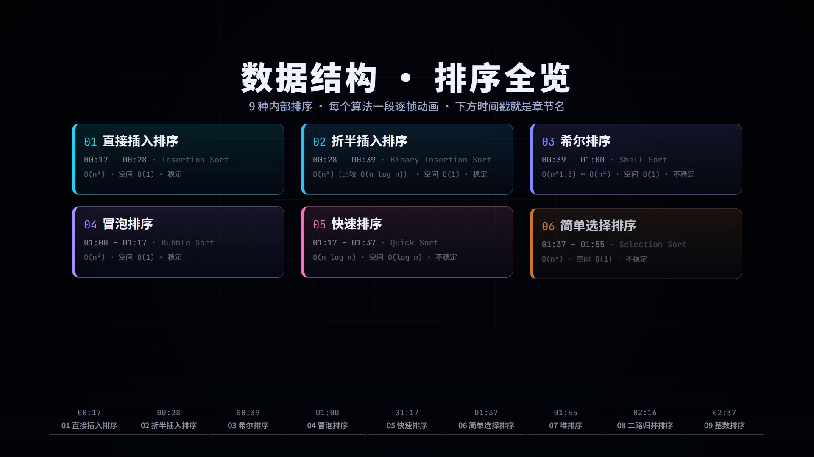
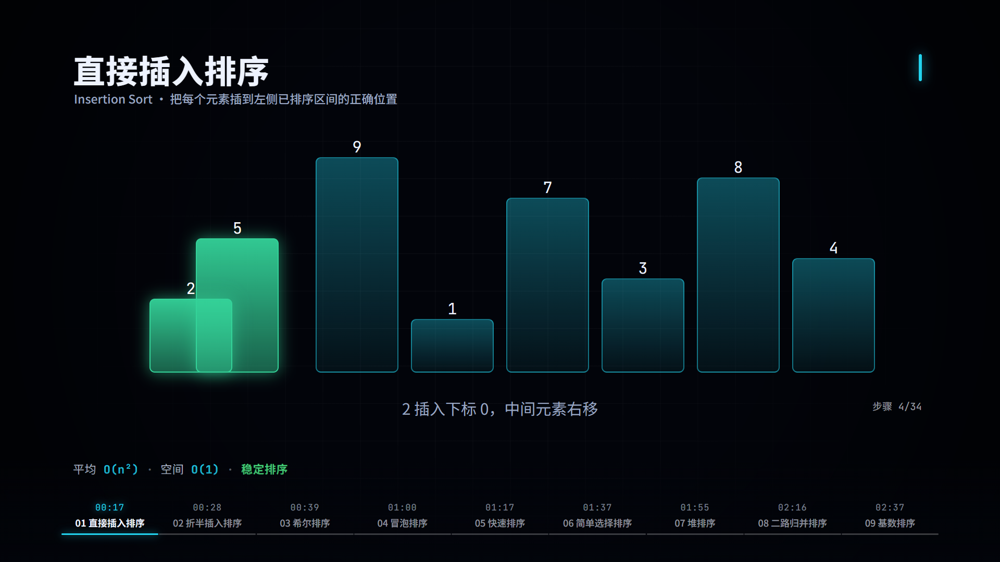
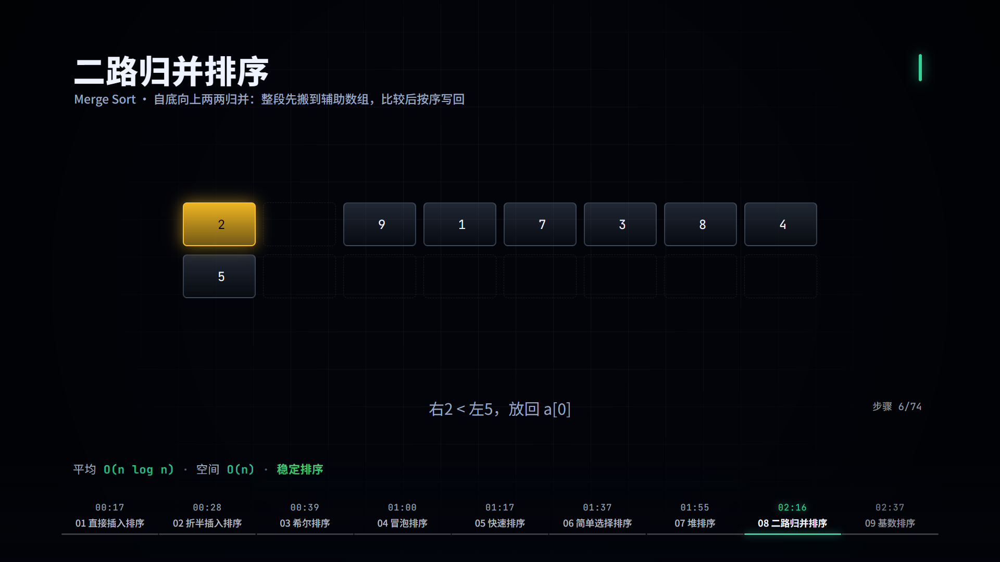
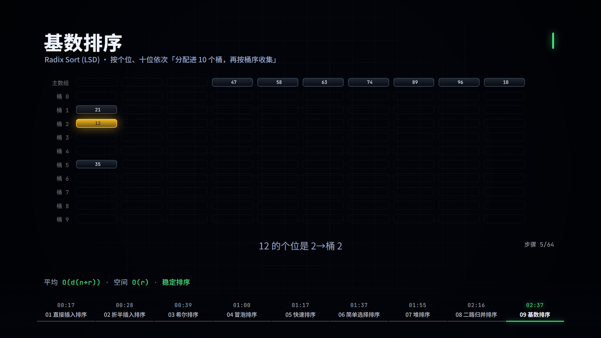
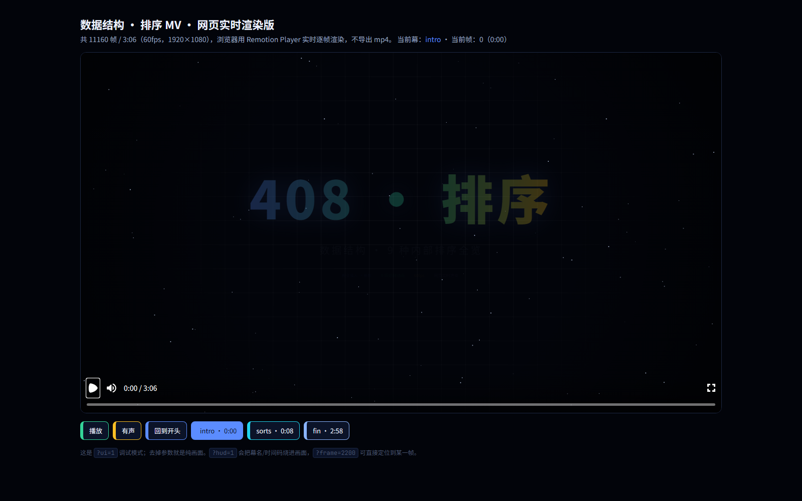

# 数据结构 · 排序 MV（Remotion 工程 → 网页实时版）

> 🎬 在线预览（GitHub Pages，浏览器实时逐帧渲染，不播 mp4）：**https://futabaly.github.io/ds/sorting-mv/**

9 种内部排序，每个算法一段逐帧动画。同一套 Remotion（React）代码产出两种东西：

| 输出 | 命令 | 说明 |
|---|---|---|
| 渲染成片 mp4 | `npm run render` | `remotion render MV408 out/mv.mp4`，h264 / crf 17 / yuv420p；已导出的成品在仓库根目录 `mv.mp4`（186.005 s / 56 MB） |
| 网页实时版 | `npm run web:dev` / `npm run web:build` | `@remotion/player` 在浏览器里逐帧实时渲染，不导出视频 |
| 文档截图 | `node scripts/make_screenshots.mjs` | 重出 `docs/screenshots/`（前 4 张 Remotion 逐帧渲染 + 最后 1 张网页版真实截图） |
| 子集字体 | `python scripts/fetch_fonts.py` | 改了文案出现新字时重跑，保证成片与网页用的是同一套字型 |

画面底部有一条**时间戳条**：每个排序的起始时间 + 名字，当前那一段高亮。它不是网页 UI，是烧进视频的。

## 效果预览

| 目录镜头（9 种排序 + 时间戳） | 直接插入排序 | 归并排序（主数组 + 辅助数组两行） |
|---|---|---|
|  |  |  |

| 基数排序（主数组 + 10 个桶） | 网页调试界面 `?ui=1`（章节跳转 + 帧读数） |
|---|---|
|  |  |

网页版默认就是**一块视频**：整屏黑底 + 16:9 画面，没有页面说明、没有章节按钮、播放器也没有进度条 —— 唯一的进度信息是画面底部那条烧进视频的时间戳条。截图都是这套工程真跑出来的（headless Chrome 打开 dev server，`?frame=` 定位到指定帧）。

## 内容结构

全片 **11160 帧 / 3 分 06 秒 @ 60fps**：开场 8s → 排序全览（目录镜头 + 9 个算法）→ 结尾 8s。

| # | 章节（= 画面底部时间戳条上的名字） | 起始 | 时长 | 平均 | 空间 | 稳定性 |
|---|---|---|---|---|---|---|
| 01 | 直接插入排序 | 00:17 | 11.3s | O(n²) | O(1) | 稳定 |
| 02 | 折半插入排序 | 00:28 | 11.3s | O(n²)（比较 O(n log n)） | O(1) | 稳定 |
| 03 | 希尔排序 | 00:39 | 21.0s | O(n^1.3) ~ O(n²) | O(1) | 不稳定 |
| 04 | 冒泡排序 | 01:00 | 17.0s | O(n²) | O(1) | 稳定 |
| 05 | 快速排序 | 01:17 | 20.0s | O(n log n) | O(log n) | 不稳定 |
| 06 | 简单选择排序 | 01:37 | 17.3s | O(n²) | O(1) | 不稳定 |
| 07 | 堆排序 | 01:55 | 21.0s | O(n log n) | O(1) | 不稳定 |
| 08 | 二路归并排序 | 02:16 | 21.0s | O(n log n) | O(n) | 稳定 |
| 09 | 基数排序 | 02:37 | 21.0s | O(d(n+r)) | O(r) | 稳定 |

- 镜头时长 = 该算法的步数 × 20 帧，夹在 8s ~ 21s 之间（步数越多放得越慢，观感更稳）。
- 这张表就是 `src/timeline.ts` 里的 `SORT_CHAPTERS`：底部时间戳条、目录镜头、章节跳转按钮全部由它渲染，`timeline.ts` 末尾还有断言保证它和平铺出来的时间轴完全一致。
- 想重新生成这张表：`npm run timeline` 之后看 `audio/timeline.json` 的 `chapters`（配乐的小节划分也读同一个文件）。

## 快速开始

```bash
npm install

npm run studio       # Remotion Studio 预览（改代码即时看效果）
npm run web:dev      # 网页实时版：Vite 开发服务器
npm run render       # 渲染成片 out/mv.mp4（首次会下载 Chrome Headless Shell）
npm run still        # 只渲染一帧 out/still.png

npm run check        # 类型检查 + 9 个排序算法的快照自检
npm run timeline     # 把 src/timeline.ts 导出成 audio/timeline.json
npm run audio        # 用 numpy 程序化生成配乐 public/music.wav
npm run audio:mp3    # 转出网页流播版 web-public/music.mp3（需要 ffmpeg）
```

## 排序动画是怎么做出来的

### 1. 算法只产出「快照序列」

每个排序算法是一个**纯函数**：输入一个数组，输出一串快照。

```ts
type Snap = {
  rows: (Elem | null)[][];   // rows[0] = 主数组；rows[1..] = 辅助数组 / 桶
  hi?: number[];             // 正在比较或移动的元素 id（琥珀色）
  done?: number[];           // 已归位的元素 id（青色）
  pivot?: number;            // 基准元素（品红）
  note: string;              // 这一步在做什么 → 画面下方的字幕
};
```

算法里没有任何 React、没有时间、没有缓动 —— 只有「第几步长什么样」。所以：

- 画面可以任意 seek（网页里拖进度条、点章节跳转）都自洽；
- 渲染成片和网页实时播放结果完全一致；
- 调动画只改渲染器，调算法只改一个文件，互不干扰。

### 2. 一条硬性约束：每个快照都必须是**合法排列**

所有元素 id 在任何一个快照里都必须恰好出现一次，不许重复、不许消失。

因为渲染器是按 **id** 追踪元素位置的（这样元素跨行移动也能平滑插值）：

- 出现重复 → 两根柱子重叠；
- 元素消失 → 柱子闪没。

所以移位类算法不能用 `arr[j+1] = arr[j]` 这种「中间态里有重复元素」的经典写法，要用 `splice` 真正把元素搬过去（取出 → 挪位 → 插入）。这条约束由 `npm run check:sorts` 自动检查，9 个算法每个快照都会过一遍。

### 3. 渲染器按元素 id 追踪位置并插值

`src/scenes/sorts/SortStage.tsx` 是 9 个算法共用的渲染器：拿到当前快照和上一个快照，算出每个元素在两边的格子位置，再用 10 帧做缓动插值 —— 于是柱子是「滑过去」而不是瞬移。柱高 ∝ 数值，颜色就是 `hi / done / pivot` 三种状态。

### 4. 需要辅助空间的算法用「多行」

- **归并排序**：`rows[1]` 是辅助数组。先把待归并的两段逐个搬进辅助数组（主数组留 `null` 空洞），再比较两段头部逐个写回主数组 —— 动画里元素是垂直上下的，非常好懂。
- **基数排序**：`rows[1..10]` 是 10 个桶。按当前位分配进去、再按桶序收集回来，跑个位和十位两趟。

空位会画成虚线框，所以「桶」和「缓冲区」的形状一眼能看出来。

### 5. 加一个新算法 = 加一个文件

照 `src/scenes/sorts/algo_insertion.ts` 的模子写：

```ts
export const mySort: Algo = {
  key: 'mysort', name: '我的排序', sub: 'My Sort',
  time: 'O(n log n)', space: 'O(1)', stable: false, idea: '一句话思路',
  build(input) {
    const out: Snap[] = [];
    // …推快照，照 engine.ts 的约束来
    return out;
  },
};
```

然后在 `src/timeline.ts` 的 `SORTS` 数组里加进去 —— 章节表、底部时间戳、目录镜头、镜头时长、配乐小节数全都会自动跟着变。

### 6. 章节表 ↔ 时间轴，靠断言保证一致

`SORT_CHAPTERS` 是底部时间戳条和目录镜头的唯一数据源。它按「开场长度 + 目录长度 + 每个算法步数 × 20 帧」算出每段的起止帧，`timeline.ts` 末尾有一段断言：只要章节时间戳和平铺出来的 `SHOTS` 对不上，**直接抛错**，不会悄悄错位。

## 目录结构

```
src/
  timeline.ts            ★ 唯一真相：SORTS / SORT_CHAPTERS / ACT_DEFS / SHOTS / TOTAL
  Main.tsx               主合成：背景 + 所有镜头 + 底部时间戳条 + 音频
  theme.ts               配色、字体栈、缓动与 prog() 工具
  fonts.ts               渲染端字体加载（delayRender，保证成片字型不闪）
  components/
    Shot.tsx             ★ 转场系统 + <Shots> + useF()/useShot()
    ChapterBar.tsx       ★ 底部时间戳条（排序名 + 起始时间）
    Background.tsx       随幕色渐变的背景
    ui.tsx               Txt / Arrow / Caption / ActHUD
    kit.tsx              Card / Chip / Cell / popIn / stepAt
  scenes/
    sorts/
      engine.ts          ★ 快照类型与工具（Snap / Algo / checkSnaps / shapeOf）
      SortStage.tsx      ★ 9 个算法共用的渲染器（柱子 / 格子 / 跨行插值）
      algo_*.ts          9 个排序算法，每个一个文件，只产出快照
    SortScene.tsx        排序镜头外壳（标题 + 舞台 + 复杂度脚注）
    SortIndex.tsx        目录镜头（9 种排序 + 时间戳一览）
    Intro.tsx / Outro.tsx / ActTitle.tsx
    CacheDemo.tsx        另一个示例镜头（Cache 命中/替换），当前没排进时间轴
web/                     网页实时版外壳（Player + 可选调试 UI）
web-public/              网页上线用静态资源（music.mp3 / fonts 子集字体 / .nojekyll）
public/                  渲染用静态资源（母带 music.wav / fonts 子集字体）
audio/make_music.py      程序化配乐脚本（numpy + 标准库 wave）
scripts/                 时间轴导出、算法快照自检、字体子集化（fetch_fonts.py）
dist/                    web:build 产物（推到 gh-pages 的就是它）
```

## 网页实时版（默认居中卡片，可放大）

```tsx
<Player
  component={Main}                                        // 直接复用渲染用的主合成
  inputProps={{musicSrc: `${BASE}music.mp3`, mute, hud}}  // 网页传压缩版音频；hud 默认关
  durationInFrames={TOTAL} fps={60}
  compositionWidth={1920} compositionHeight={1080}
  controls={UI}                                          // 只有 ?ui=1 才出进度条等控件
  loop clickToPlay acknowledgeRemotionLicense
  style={{width: '100%'}}                                // 外层容器负责居中/铺满
/>
```

| URL 参数 | 效果 |
|---|---|
| 无参数 | **居中卡片**：画面居中（最大 1280px，圆角+边框+投影，不铺满整屏）；点画面播放、空格暂停/继续、双击画面或点右下「放大 ⤢」按钮全屏（全屏时底部时间戳条一起进去）；没有播放器进度条、没有章节按钮 |
| `?full=1` | 铺满整个视口（截图、iframe 嵌入时用这个） |
| `?ui=1` | 调试 UI：标题说明、章节跳转按钮、播放/静音、当前帧读数、播放器进度条 |
| `?hud=1` | 额外把幕名 / 时间码 / 进度圈（ActHUD）烧进画面（渲染成片可传 `<Composition defaultProps={{hud: true}}>`） |
| `?frame=2200` | 深链：直接定位到第 N 帧 |

- **章节跳转**：`playerRef.seekTo(ACT_RANGES[i].s)`，`?ui=1` 下那排按钮就是 `ACT_RANGES` 渲染出来的；
- **底部时间戳条可以直接点**：画面里那条是烧进视频的（渲染成片里也有，静态信息），网页版在**同一位置**叠了一层透明按钮（实测对齐误差 < 0.01%），点哪个排序就跳到那一段——多跳 0.6 秒，避免暂停时停在转场模糊帧上；
- **状态回读**：播放器用事件往外推状态（`play` / `pause` / `frameupdate`）——
  ⚠️ `onFrameUpdate` 这类 prop 在新版 `@remotion/player` 里已经没有，要用 `addEventListener('frameupdate', …)`；
- **字体**：`FontFace` 异步加载，不阻塞首屏；渲染端则用 `delayRender/continueRender` 等字体就绪。

## 两套静态资源：`public/` vs `web-public/`

| 目录 | 给谁用 | 放什么 |
|---|---|---|
| `public/` | Remotion 渲染（`staticFile()`） | 母带 `music.wav`（31 MB，`.gitignore` 掉）、`fonts/` 子集字体 |
| `web-public/` | 网页上线（Vite `publicDir`） | 压缩版 `music.mp3`、`fonts/` 同一套子集字体、`.nojekyll` |

字体是**随仓库提供的子集字体**（`Noto Sans SC` + `JetBrains Mono`，共约 0.5 MB，两个目录各一份），
由 `python scripts/fetch_fonts.py` 按「源码里实际出现的字符」从 Google Fonts 裁剪生成 —— 改了文案出现新字就要重跑一次。
详见 [`public/fonts/README.md`](public/fonts/README.md)。

这样 `web:build` 出来的 `dist/` 不会把几十 MB 的母带带上线。

## 音频也是「算」出来的

`audio/make_music.py` 只用 numpy + 标准库 `wave`：120 BPM、1 小节 = 2 秒 = 120 帧，段落划分读 `audio/timeline.json`（由 `src/timeline.ts` 导出）—— 所以镜头天然落在小节线上，正片变长/变短，配乐自己跟着变。音色包括 pad、拨弦、FM 铃铛、底鼓、hi-hat、噪声 riser，外加一个廉价梳状混响。

```bash
npm run timeline && npm run audio && npm run audio:mp3
```

## 部署到 GitHub Pages

```bash
npm run web:build                 # 产物在 dist/
git subtree push --prefix dist origin gh-pages
```

- 自定义域名：在 `web-public/CNAME` 里写一行域名（构建时拷进 dist）；
- `web-public/.nojekyll` 关掉 GitHub Pages 的 Jekyll 处理；
- `vite.config.mts` 里 `base: './'`，放项目页子路径也能跑；
- 私有仓库开 Pages 需要 Pro/Team 及以上，或用 Cloudflare Pages / Vercel 连私有仓库自动构建。

## 已验证 / 未验证

- ✅ `npm run check:sorts`：9 个排序算法全部通过（每个快照都是合法排列 + 最终升序 + 步数合理）
- ✅ `npm run typecheck`（tsc 0 错误）、`npm run web:build`、`npm run timeline`、`npm run audio`（配乐 + mp3）
- ✅ 网页实时版真实渲染：headless Chrome 打开 dev server 逐一截图（目录 / 插入 / 归并 / 基数 / 调试界面）
- ✅ **线上 Pages 与本地 dev 同一帧截图 sha256 完全一致**（`c8983c14…`）—— 逐帧渲染是确定性的，本地看到的和线上一样
- ✅ GitHub Actions 自动部署：push 到 `main` → `npm ci` → `check:sorts` → `typecheck` → `web:build` → 发布 `dist`（见 `.github/workflows/deploy-web.yml`）
- ✅ `npm run studio`：Remotion Studio 能打开 MV408，读到的尺寸/帧率/时长与 `src/timeline.ts` 一致
- ✅ **`npm run render` 已实跑**：`out/mv.mp4` = 11160 帧 / **186.005 s** / h264 1920×1080@60fps / AAC 48kHz 立体声 / 56 MB
      （抽帧核对过画面与字体；仓库根目录的 `mv.mp4` 就是这次导出的成品）
- ✅ 文档截图可用 `node scripts/make_screenshots.mjs` 一键重出（帧号按 `src/timeline.ts` 的章节位置算，不写死）

## 渲染性能（实测，供下次参考）

同一段 180 帧（3 秒）的渲染耗时，本机 RTX 5060 + 16 逻辑核：

| 配置 | 耗时 | 结论 |
|---|---|---|
| 默认（SwiftShader 软件光栅，默认并发） | 15.0 s | 基准 |
| `--gl=angle`（走真实显卡） | 15.8 s | **反而慢 5.7%，没用** |
| `--concurrency=12` | 16.6 s | 更慢（线程争用） |
| `--concurrency=16` | 14.0 s | 最快，约 +7% |

结论：这类**文字/色块为主的 DOM 动画，瓶颈在浏览器布局绘制与编码，不在光栅化**，所以 GPU 帮不上忙
（GPU 只对 WebGL / 大量 canvas 绘制的合成有意义）。想快就调 `--concurrency`，全片 11160 帧约 11–12 分钟。
